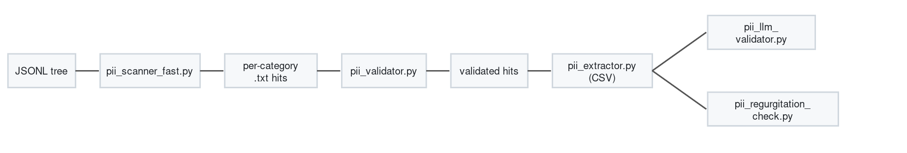

# PII scan

Regex-based PII detection pipeline for JSONL datasets. Runs **independently** of the synth-data-gen pipelines.

## Pipeline



| Stage | Script | Purpose |
|-------|--------|---------|
| 1 — regex scan | `pii_scanner_fast.py` | Parallel scan of `**/*.jsonl`; writes one `.txt` per PII category |
| 2 — heuristic filter | `pii_validator.py` | Drops regex false positives via `validator/` rules |
| 3 — enrich | `pii_extractor.py` | Joins hits with original JSONL lines → CSV |
| 4a — LLM confirm | `pii_llm_validator.py` | Asks a chat model whether the candidate is real PII in context |
| 4b — regurgitation probe | `pii_regurgitation_check.py` | Tests whether a model reproduces withheld PII values |

Optional utility: `count_unique_conversations.sh` — deduplicated hit counts per category.

## Input format

JSONL rows with either:

- `"text"`: plain string, or
- `"messages"`: chat array — all message contents are concatenated and scanned.

Compatible with pipeline outputs, seeds, and benchmark JSONL.

## Output layout

Each run writes to a **run root** (`PII_RUN_DIR` or `PII_OUTPUT_DIR`):

```text
<run_root>/
  stage1_scan/
    metrics.txt          ← start here (stage 1 summary)
    hits/
      phones.txt         ← one file per PII category
      street_addresses.txt
      ...
    workers/             ← internal shards (safe to ignore)
      worker_0/
      worker_1/
  stage2_validated/
    metrics.txt          ← stage 2 summary (after pii_validator.py)
    hits/
      phones.txt         ← heuristic-filtered hits only
      ...
```

**Hit line format** (inside any `hits/*.txt`):

```text
relative/path.jsonl|<line_number>|<source_line_sha256>|<matched_text>
```

The source-line hash binds every hit to the exact JSONL row scanned in Stage 1.
Stage 3 verifies it before attaching source context.

**What to read:**
1. `stage1_scan/metrics.txt` — scan stats and raw hit counts
2. `stage2_validated/metrics.txt` — how many hits survived validation
3. `stage2_validated/hits/` — only open these if stage 2 kept something

Legacy flat layouts (category `.txt` files directly under the output folder) are still read by stage 2 if you point `PII_SCAN_OUTPUT_DIR` at them.

## Output format (stages 3–4)

```
file,line,source_sha256,category,PII,whole line
```

The `whole line` column holds the **full original JSONL record** so downstream LLM stages retain every source column.
`PII` is the exact source substring reviewed by the LLM. Stage 3 fails if that
substring is absent from the text extracted from `whole line`.
`source_sha256` binds the candidate and final decision to the exact original
JSONL row.

Standalone US ZIP codes and UK postcodes are intentionally excluded. They are
not sufficiently identifying on their own, and meaningful full addresses remain
covered by the street-address category.

For quality-filter runs, stages 1 and 3 verify every source file against the
same content-addressed `manifest.json` snapshot before reading it. A changed
source file fails the shard instead of joining stale line coordinates to
unrelated records.

**Column retention:** unlike toxicity stage 2 (which annotates JSONL in place), the PII pipeline keeps originals untouched and writes parallel artifacts. Joining results back onto JSONL (adding a `pii` block per row) is a planned integration step.

## When to run

| Timing | Typical input | Notes |
|--------|---------------|-------|
| **Before generation** | Seed JSONL under `data/` | Catch PII in source material before synth |
| **After generation** | Pipeline output JSONL | QA gate on generated conversations |

CPU-only for stages 1–3; stages 4a/4b need an OpenAI-compatible LLM endpoint.

**Run on worker nodes via SLURM** (do not run scans on the login node).

## Install

```bash
cd modelsafety/data_screening/pii/regex
python3 -m venv .venv && source .venv/bin/activate
pip install -r requirements.txt
```

The SLURM script below creates the venv on first run if it is missing.

## Usage

### SLURM — stages 1 + 2 (recommended)

Default test paths (`tmp/qa_scan_test/input` → `tmp/qa_scan_test/pii_run`):

```bash
cd /path/to/qvac-model-safety
sbatch launchers/slurm/run_pii_scan.sbatch
```

Custom input/output:

```bash
sbatch --export=ALL,PII_BASE_DIR=/path/to/jsonl/root,PII_RUN_DIR=/path/to/pii_run,PII_NUM_WORKERS=32 \
  launchers/slurm/run_pii_scan.sbatch
```

Logs land under `logs/scans/pii_scan/run_<jobid>/`:

```text
main/pii_scan_<jobid>.log
err/pii_scan_<jobid>.err
stage1/regex_scan_<jobid>.log
stage2/heuristic_validation_<jobid>.log
reports/summary_<jobid>.txt
```

SLURM bootstrap stdout/stderr land under `logs/slurm/pii_scan_<jobid>.out`
and `.err`.

Results: read `stage1_scan/metrics.txt` and `stage2_validated/metrics.txt` under `PII_RUN_DIR`.

### Manual — stages 1 + 2 (worker / interactive session only)

`pii_scanner_fast.py` imports `modelsafety.contract.textract`, so the repo
root needs to be on `PYTHONPATH` when running it outside the sbatch wrapper
(the wrapper sets this for you):

```bash
export PII_BASE_DIR=/path/to/jsonl/root
export PII_RUN_DIR=/path/to/pii_run
export PII_NUM_WORKERS=32
export PII_CHUNK_SIZE=10000
export PYTHONPATH=/path/to/qvac-model-safety

python pii_scanner_fast.py
python pii_validator.py
```

### Stage 3 — extract CSV

```bash
python pii_extractor.py \
  --input-dir /path/to/out/validated-pii-fast-data \
  --source-root /path/to/jsonl/root \
  --output /path/to/out/pii_extract.csv
```

### Stage 4 — LLM validation / regurgitation (optional)

Both scripts take the stage-3 CSV and talk to an OpenAI-compatible API. See `--help` on each script for endpoint and concurrency flags.

### Optional — unique conversation counts

```bash
./count_unique_conversations.sh /path/to/out/pii-fast-data
```

## Environment variables

| Variable | Default | Used by |
|----------|---------|---------|
| `PII_BASE_DIR` | (required) | `pii_scanner_fast.py` — root to scan |
| `PII_RUN_DIR` | `{script}/out/pii_run` | both stages — run root folder |
| `PII_OUTPUT_DIR` | same as `PII_RUN_DIR` | stage 1 (alias) |
| `PII_SCAN_OUTPUT_DIR` | `{run}/stage1_scan/hits` | stage 2 input override |
| `PII_VALIDATED_OUTPUT_DIR` | `{run}/stage2_validated/hits` | stage 2 output override |
| `PII_NUM_WORKERS` | `100` | stages 1–2 |
| `PII_CHUNK_SIZE` | `10000` | stage 1 line chunks |
| `PII_LOG_ROOT` | `{repo}/logs/scans/pii_scan/run_<jobid>` | SLURM wrapper logs |

## Removed / obsolete scripts

| Removed | Reason |
|---------|--------|
| `pii_scanner.py` | Superseded by `pii_scanner_fast.py` (line-chunk parallelism) |
| `run_pii_scanner*.sh` | Hardcoded cluster paths; run stages directly or via your own `sbatch` |

No message-format conversion scripts — pipelines already emit the `messages` shape these scanners expect.

Also **not** included: the separate Nemotron token-classifier pipeline (`OpenMed/privacy-filter-nemotron`) from Alex's `pii-peline/pii/` tree. That is a different ML-based approach from this regex stack.

## Future integration

- Post-pipeline QA on generated JSONL.
- Pre-generation scan on seeds.
- JSONL enrichment step: merge validated hits back as a `pii` field without dropping existing columns.
- SLURM wrappers under `launchers/` for CPU-heavy stage 1 on the health partition.
