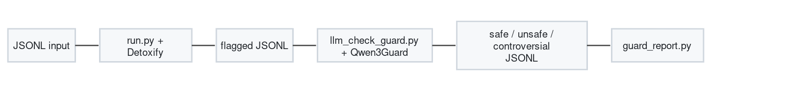

# Toxicity scan

Two-stage toxicity screening for JSONL datasets. Runs **independently** of the synth-data-gen pipelines: point it at any JSONL file or directory (pipeline output, seeds, benchmarks).

## Pipeline



| Stage | Script | Purpose |
|-------|--------|---------|
| 1 — fast screen | `run.py` | Detoxify multilingual model; flags rows above a score threshold |
| 2 — guard verify | `llm_check_guard.py` | Qwen3Guard via an OpenAI-compatible endpoint (vLLM) |
| Report | `guard_report.py` | Summarize safety labels by role (user / assistant) |

Supporting library: `detoxify.py` (vendored Detoxify wrapper).

## Input format

JSONL rows with either:

- `"text"`: a plain string to scan, or
- `"messages"`: chat array — stage 1 emits one candidate row **per message** as `"role: content"`.

This matches pipeline outputs (`messages`, `metadata`, `pipeline_info`, …) and seed/benchmark JSONL from `prepare_benchmark_messages.py`.

## Output format

**Stage 1** (`run.py`) writes a slim intermediate JSONL:

```json
{"conversation": [...], "text": "assistant: ...", "toxicity": 0.73}
```

**Stage 2** (`llm_check_guard.py`) reads stage-1 rows, adds a `guard` block, and writes the **full input record** plus annotations:

```json
{
  "conversation": [...],
  "text": "assistant: ...",
  "toxicity": 0.73,
  "guard": {
    "safety": "Unsafe",
    "categories": ["Sexual Content or Sexual Acts"],
    "flagged_role": "assistant",
    "flagged_index": 2,
    "raw": "..."
  }
}
```

Outputs land in `{output_dir}/all.jsonl`, `safe.jsonl`, `unsafe.jsonl`, `controversial.jsonl`.

**Column retention:** stage 2 preserves every field already on the input record and only adds `guard`. Stage 1 currently rewrites rows into the slim `{conversation, text, toxicity}` shape — when wiring this into pipeline outputs, stage 1 should be updated to pass through all source columns unchanged and only append toxicity fields. That is the target contract for both pre- and post-generation scans.

## When to run

| Timing | Typical input | Notes |
|--------|---------------|-------|
| **Before generation** | Seed JSONL (`text` or early `messages`) | Filter or flag toxic seeds before synth |
| **After generation** | Pipeline output JSONL | QA gate on generated `messages` |

Both scans are offline batch jobs — no coupling to `launchers/slurm/run_with_slurm.sh`.

## Install

```bash
cd synth_data_gen/tools/data_prep/toxicity
python3 -m venv .venv && source .venv/bin/activate
pip install -r requirements.txt
```

Stage 2 additionally needs a running Qwen3Guard endpoint (same vLLM pattern as the main pipelines).

## Usage

### SLURM — stages 1 + 2 with vLLM (recommended)

Default QA test paths:

```bash
cd synth_data_gen
sbatch tools/data_prep/toxicity/run_toxicity_scan.sbatch
```

Custom input/output:

```bash
sbatch --export=ALL,TOX_INPUT=/path/to/data.jsonl,TOX_RUN_DIR=/path/to/toxicity_out \
  tools/data_prep/toxicity/run_toxicity_scan.sbatch
```

The wrapper runs Detoxify stage 1, starts Qwen3Guard with vLLM from the enroot
SquashFS image, waits for the `/health` endpoint, runs stage 2, writes a guard
report, and stops vLLM on exit.

Default outputs under `TOX_RUN_DIR`:

```text
flagged.jsonl                  # stage-1 Detoxify hits
guard_results/all.jsonl         # all stage-2 guard results
guard_results/safe.jsonl
guard_results/unsafe.jsonl
guard_results/controversial.jsonl
```

Logs land under `logs/scans/toxicity_scan/run_<jobid>/`:

```text
main/toxicity_scan_<jobid>.log
err/toxicity_scan_<jobid>.err
stage1/detoxify_<jobid>.log
stage2/qwen3guard_<jobid>.log
vllm/vllm_guard_<jobid>.log
reports/guard_report.txt
```

SLURM bootstrap stdout/stderr land under `logs/slurm/toxicity_scan_<jobid>.out`
and `.err`.

Useful overrides:

| Variable | Default |
|----------|---------|
| `TOX_INPUT` | `tmp/qa_scan_test/input/data_000000_messages_pipeline.jsonl` |
| `TOX_RUN_DIR` | `tmp/qa_scan_test/toxicity_out` |
| `TOX_LOG_ROOT` | `logs/scans/toxicity_scan/run_<jobid>` |
| `TOX_THRESHOLD` | `0.5` |
| `TOX_BATCH_SIZE` | `32` |
| `GUARD_MODEL` | `Qwen/Qwen3Guard-Gen-8B` |
| `GUARD_CONCURRENCY` | `8` |
| `VLLM_SQUASHFS_PATH` | `containers/vllm-openai-v0.24.0-cu129.sqsh` |
| `VLLM_ENABLE_CUDA_COMPATIBILITY` | `1` |

### Stage 1 — Detoxify screen

```bash
accelerate launch run.py \
  --input /path/to/data.jsonl \
  --model_name multilingual \
  --dest_file /path/to/flagged.jsonl \
  --batch_size 64 \
  --threshold 0.5
```

### Stage 2 — Qwen3Guard verification

Start vLLM separately (or reuse an existing server), then:

```bash
python llm_check_guard.py \
  --input /path/to/flagged.jsonl \
  --output /path/to/guard-results \
  --base_url http://localhost:8000/v1 \
  --model Qwen/Qwen3Guard-Gen-8B \
  --concurrency 64
```

### Report

```bash
python guard_report.py /path/to/guard-results --format rich
```

## Removed / obsolete scripts

These were dropped when importing from Alex's repo:

| Removed | Reason |
|---------|--------|
| `llm_check.py` | Superseded by `llm_check_guard.py` (Qwen3Guard + vLLM) |
| `*.slurm` | Hardcoded cluster paths; submit via `sbatch` on the health partition using your own launcher |
| `true_positive_flagged_report.md` | One-off manual review artifact, not a tool |

No message-format conversion scripts live here — the synth pipelines already emit `messages` JSONL; these scanners read that shape directly.

## Future integration

- Hook as a post-pipeline QA step on `output/` JSONL.
- Optional pre-generation gate on seed files under `data/`.
- Update `run.py` to retain all source columns (see column-retention note above).
- SLURM wrappers can live under `launchers/` once paths and vLLM settings are aligned with the main pipeline launchers.
